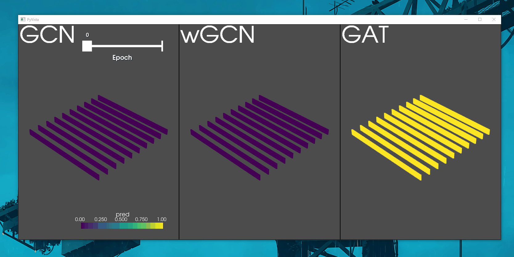

## geo_graph interpolator

 

**geo_graph interpolator** shows a workflow for using non graph structured geoscience data in **Graph Neural Networks** as implemented using <a href="(https://github.com/dmlc/dgl">Deep Graph Library</a>. Inclusive in this repo is a process to generate a simplistic geo_graph using synthetic data. Due to the 3D nature of the dataset 3D visualisation is handled using <a href="(https://docs.pyvista.org/">pyvista.</a>

Graph neural networks implemented in a semi-supervised setting are abe to outperform triliniear interpolation. Further, by embedding node features into the graph it is possible to have interpolation follow geological and geophysical properties, similar to techniques like kriging. The key advantages of graph based methods is the ability to explicitly define the relationships used by the algorithm as apposed to the implicit relationships used by traditional methods.

This repository demonstrates a simple workflow, to demonstrate how a user could generate their own geo_graphs, for interpolation tasks.
For a step through of the code consider the demonstration notebook.

----
### Getting Started

This code uses several open access packages and used conda for version control, these requirements can be installed using the provided requirements.yml file. For a guide to setting up a conda environemnt consider the <a href="(https://conda.io/projects/conda/en/latest/user-guide/tasks/manage-environments.html">conda documentation</a>. Two versions of the file are provided to allow for GPU support. However we note that for smaller graphs computational times are not inhibitive.

The key functions are imported into the demonstration notebook from the geo-graph interpolator module. Running each cell in the notebook will automatically predict on the graph and a 3D window opens displaying the prediction.

----
### Building Graphs from non-graph data

Most geoscience data has no intrinsic graph structure. As a user defining the nodes and edges correctly will have the biggest impact on our method. Typically the nodes are defined using our geological/geophysical measurements, the edges are the relationships between points. If you're wanting to devise your own graphs consider our paper ____ for more details of the significance of these edges. 

Using Simpeg we can generate a simple set of TDEM sections, and convert them to the nodes of our graph. We then define two sets of edges based on the distribution of stations and their node parameters for comparison. Inluded in the respository are premade data for demonstration purposes.

NOTE - The edge method generation tied to similarity is poorly optimised and for the demo data results in a dummy filed ~ 16GB in size.

----

### Graph Neural Networks

 
We present three simple variations of the graph neural networks presented in the papers below, their code can be found in gnn submodule.

 * <a href="(https://arxiv.org/abs/1609.02907">GCN</a>   - Graph Convolutional Network
 * <a href="(https://arxiv.org/abs/1710.10903">GAT</a>   - Graph Attention Network
 * <a href="(https://arxiv.org/abs/2104.14060">wGCN</a>  - Weighted Graph Convolutional Network  

----